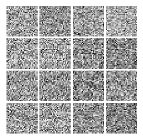
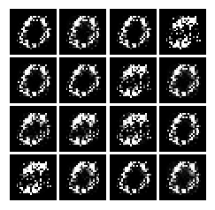
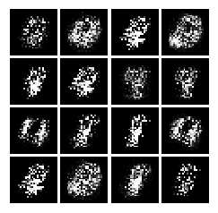
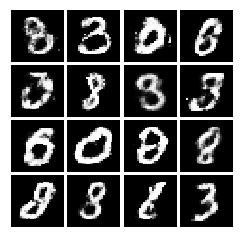
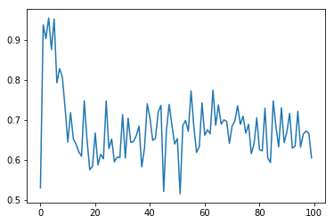
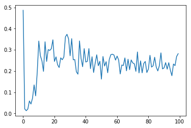

# Generative_Adversarial_Networks using nn.Sequential model

Generator Model:

`Generator (
  (main): Sequential (
    (0): Linear (100 -> 128)
    (1): ReLU (inplace)
    (2): Linear (128 -> 784)
    (3): Sigmoid ()
  )
)`

Discriminator Model:

`Discriminator (
  (main): Sequential (
    (0): Linear (784 -> 128)
    (1): ReLU (inplace)
    (2): Linear (128 -> 1)
    (3): Sigmoid ()
  )
)`

Results : 
* **Before start of training** : 

* **After one iteration** : 

* **After two iterations** : 

* **After a hundred thousand iterations** : 

**Generator's Loss** : 

**Discriminator's Loss** : 
