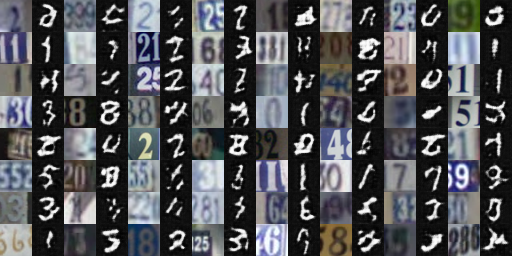
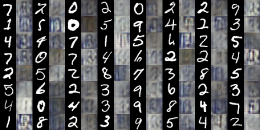

# Style Transfer using Cycle-Consistent Generative Adversarial Networks

PyTorch Implementation of [CycleGAN](https://arxiv.org/pdf/1703.10593.pdf) for Domain Transfer.

<br>

## Usage
```
usage: main.py [-h] [--image_size IMAGE_SIZE] [--g_conv_dim G_CONV_DIM]
               [--d_conv_dim D_CONV_DIM] [--train_iters TRAIN_ITERS]
               [--batch_size BATCH_SIZE] [--num_workers NUM_WORKERS] [--lr LR]
               [--beta1 BETA1] [--beta2 BETA2] [--cuda] [--mode MODE]
               [--model_path MODEL_PATH] [--sample_path SAMPLE_PATH]
               [--mnist_path MNIST_PATH] [--svhn_path SVHN_PATH]
               [--log_step LOG_STEP] [--sample_step SAMPLE_STEP]

optional arguments:
  -h, --help            show this help message and exit
  --image_size IMAGE_SIZE
  --g_conv_dim G_CONV_DIM
  --d_conv_dim D_CONV_DIM
  --train_iters TRAIN_ITERS
  --batch_size BATCH_SIZE
  --num_workers NUM_WORKERS
  --lr LR
  --beta1 BETA1
  --beta2 BETA2
  --cuda                enables cuda
  --mode MODE
  --model_path MODEL_PATH
  --sample_path SAMPLE_PATH
  --mnist_path MNIST_PATH
  --svhn_path SVHN_PATH
  --log_step LOG_STEP
  --sample_step SAMPLE_STEP
```

#### Clone the repository

Training CycleGAN
-------------------
### MNIST-SVHN

    $ python main.py (add --cuda flag for GPU)

<br>


## Results

#### 1) CycleGAN (500 iterations)

From SVHN to MNIST            |  From MNIST to SVHN
:-------------------------:|:-------------------------:
  |  