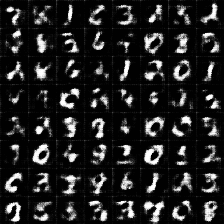
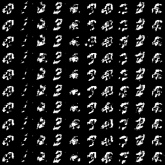

# Keras Wasserstein-GAN

## Introduction
Improved implementation of Wasserstein GAN in keras using MNIST dataset.

## Results
### MNIST
* Generated images

<table align='center'>
<tr align='center'>
<td> DCGAN</td>
<td> WGAN</td>
</tr>
<tr>
<td>
<td>
</tr>
</table>

## Requirements

 - Python (2.7 or 3.5)
 - Keras 2.0.2
 - Matplotlib

## References

-Improved Training of Wasserstein GANs(paper) -> https://arxiv.org/abs/1704.00028
- [Read-through: Wasserstein GAN](https://www.alexirpan.com/2017/02/22/wasserstein-gan.html)
- [Geometric Intuition on Improved Wasserstein GANs](http://lernapparat.de/improved-wasserstein-gan)
